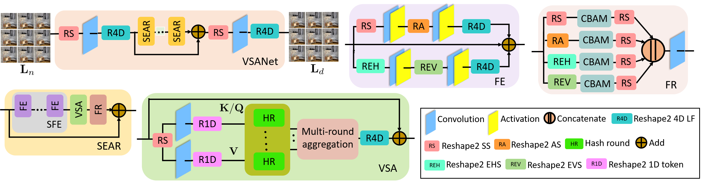

# VSANet: View-aware Sparse Attention Network for Light Field Image Denoising

[Arxiv](https://arxiv.org/abs/2606.24737)  

> **Abstract:**Light field (LF) image denoising is challenging due to the high-dimensional structure of LF data. While noise is independent across sub-aperture images, scene content exhibits strong cross-view correlations. We introduce VSANet, a view-aware sparse attention network for LF denoising. Specifically, we propose a view-aware sparse attention (VSA) block that represents the 4D LF feature map as a unified spatial-angular token space and performs cross-view aggregation via locality-sensitive hashing-based sparse attention. This enables global feature interactions with linear complexity, effectively exploiting LF correlations across views and spatial locations. In addition, we design a feature refinement (FR) block to emphasize informative features in spatial, angular, and epipolar subspaces. The VSA and FR blocks are integrated within a sequential attention refinement module, forming the core of VSANet. Experiments demonstrate VSANet outperforms state-of-the-art LF denoising methods. ** 



## Dependencies
- Python 3.10
- PyTorch 2.5.1
- NVIDIA GPU + [CUDA](https://developer.nvidia.com/cuda-downloads)

## Create environment and install packages
```
conda create -n VSANet python=3.10
conda activate VSANet
pip install -r requirements.txt
```

## Contents
1. [Datasets](#Datasets)
2. [Pretrained](#Pretrained)
3. [Training](#Training)
4. [Testing](#Testing)
5. [Citation](#Citation)

## Datasets

Used training and testing sets can be downloaded as follows:

Trainset STFLytro [GoogleDrive](https://drive.google.com/file/d/13YJlRqhNijItA61DPh2XzOFQf7v6f35O/view?usp=drive_link)

Testset STFLytro [GoogleDrive](https://drive.google.com/file/d/1KEb-Q-H-VCyk83fhwuR3zPicm7GXXV6I/view?usp=drive_link), EPFL [GoogleDrive](https://drive.google.com/file/d/1u0j1U6VFvxFvWWP2fNSmaJTMT5ILRi-X/view?usp=sharing)

Download training and test sets and keep them in location `datasets`.

## Pretrained

Pre-trained network parameters can be downloaded from: 

[GoogleDrive](https://drive.google.com/drive/folders/1W1fZGyKb-GCnXYrlQS3brGMbB0_rG3Nd?usp=sharing)

Download pretrained weights and keep into the `checkpoints/` folder.

## Training 

- Download trainset [GoogleDrive](https://drive.google.com/file/d/13YJlRqhNijItA61DPh2XzOFQf7v6f35O/view?usp=drive_link) (STFLytro dataset), place in `datasets/` folder.

- Run the following scripts.

```
python train.py --sigma 10

python train.py --sigma 20

python train.py --sigma 50
```

## Testing

- Download the pretrained [GoogleDrive](https://drive.google.com/drive/folders/1W1fZGyKb-GCnXYrlQS3brGMbB0_rG3Nd?usp=sharing) parameters and place in `checkpoints/` folder.

- Download STFLytro test dataset from [GoogleDrive](https://drive.google.com/file/d/1KEb-Q-H-VCyk83fhwuR3zPicm7GXXV6I/view?usp=drive_link) 

- Download EPFL test dataset from [GoogleDrive](https://drive.google.com/file/d/1u0j1U6VFvxFvWWP2fNSmaJTMT5ILRi-X/view?usp=sharing) 

- Keep test datasets in location `datasets`

- Generate the denoised images on STFLytro dataset

```
python test_STFLytro.py --sigma 10

python test_STFLytro.py --sigma 20

python test_STFLytro.py --sigma 50
```

- Generate the denoised images on EPFL dataset

```
python test_EPFL.py --sigma 10

python test_EPFL.py --sigma 20

python test_EPFL.py --sigma 50
```

- The denoised images are in `results/`.
 
## Citation

If you find the code helpful in your research or work, please cite the following paper.

```
@article{panda2026vsanet,
  title={VSANet: View-aware Sparse Attention Network for Light Field Image Denoising},
  author={Panda, Gargi and Kundu, Soumitra and Bhattacharya, Saumik and Routray, Aurobinda},
  journal={arXiv preprint arXiv:2606.24737},
  year={2026}
}

```
